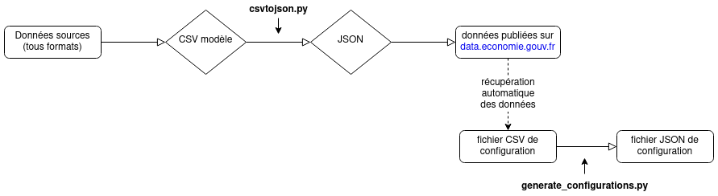

# Tableaux de bord publics

> Ce projet contient l'ensemble des éléments nécessaires à la réalisation de tableaux de bord publics. 

Ces composants ont été développé à l'origine par [Etalab](https://www.etalab.gouv.fr/) pour le [tableau de bord pour la Covid 19](https://github.com/etalab/covid19-dashboard-widgets). Ils ont initialement été repris ici, et adaptés pour l'élaboration du [tableau de bord France Relance](https://www.economie.gouv.fr/plan-de-relance/tableau-de-bord). Le travail en cours consiste à rendre modulaire ce projet, afin de permettre la production de tableaux de bord publics adaptés aux besoins de la commande.

## Installation et mise en production

Après avoir cloné ce projet, la première étape consiste à installer les bibliothèques Python requises dans un nouvel environnement virtuel.

```
python3 -m venv venv
. venv/bin/activate
pip3 install -r dashboard-configuration/requirements.txt
```

Une fois l'installation des dépendances effectuée, il convient de relancer la génération du fichier JSON de configuration du tableau de bord. Cette étape est à répéter à chaque changement du fichier CSV de configuration.

```
python3 dashboard-configuration/generate_configurations.py
```

Enfin, après avoir lancé l'installation du projet avec la commande `npm install`, il est possible de :

1. Démarrer un serveur de développement, à l'aide de la commande : `npm run serve`
2. Générer la version de production dans le dossier `dist` à la racine du projet, à l'aide de la commande : `npm run build`

## Configuration des tableaux de bord

La configuration de chaque tableau de bord se fait en deux étapes : la configuration des données et la configuration de l'affichage des données.

### La configuration des données

Il est tout d'abord nécessaire de produire un fichier de configuration des données en CSV, à l'image de `france-relance.csv`, placé au sein du dossier `dashboard-configuration`. Ce fichier permet de définir de définir l'ordre d'affichage, les informations essentielles (titre, nom des variables, etc.) et les types de graphiques à insérer au sein de chaque panel. C'est ce fichier qui est transformé en JSON par le script `generate_configurations.py`, selon un processus dont une représentation graphique est disponible dans la section [traitement des données](https://github.com/139bercy/dashboard_widgets/tree/main#traitement-des-donn%C3%A9es).

### La configuration de l'affichage des données

La configuration de l'affichage des données s'effectue dans le dossier initulé du nom du projet, par exemple `france-relance`, lui-même placé dans le dossier `public`. Celui-ci se structure typiquement de la manière suivante :

```
├── france-relance
│   ├── Logo-France-Relance.png
│   ├── france-relance.css
│   ├── france-relance.description
│   └── line-chart-configuration.json
```

Les fichiers `Logo-France-Relance.png` et `france-relance.description` permettent respectivement d'afficher le logo du commandiaire sur les graphiques et de placer un texte de présentation en introduction au tableau de bord. 

La configuration générale du style du tableau de bord est effectuée dans le fichier `france-relance.css`, tandis que les développements spécifiques à chacun des types de graphiques sont effectués dans les fichiers de la forme `line-chart-configuration.json`.

## Sources et traitement des données

### Sources

Les données publiées dans les tableaux de bord sont de la responsabilité éditoriale des commanditaires. Le code source produit par le BercyHub est publié ici en accès ouvert, et les données partagées sous un format interopérable sur <https://data.economie.gouv.fr/>.

### Traitement des données

Afin d'être intégrées dans les tableaux de bord, les données sont traitées selon le processus suivant :

1. Transformation des données sources (tous formats) en un fichier CSV modèle ;
2. Export du CSV modèle en JSON à l'aide du script `cstvojson.py`, paramétrable pour chaque projet ;
3. Publication des données sur <https://www.data.economie.gouv.fr> ;
4. Récupération de ces données à l'aide des codes d'indicateurs uniques inscrits dans le fichier CSV de configuration (`france-relance.csv` par exemple) ;
5. Transformation de ce fichier CSV en JSON de configuration final, à l'aide du script `generate_configurations.py`.

Ce processus de traitement, mis en place pour le projet France Relance, permet de paramétrer facilement l'affichage du tableau de bord pour des métiers peu familiers avec le maniement de la donnée, tout en assurant la publication en accès ouvert. Si une refonte de cette séquence pourrait être envisagée à moyen terme, celle-ci reste actuellement en fonction. Afin d'en faciliter l'appropriation, le schéma ci-dessous en présente de manière graphique les étapes essentielles.


