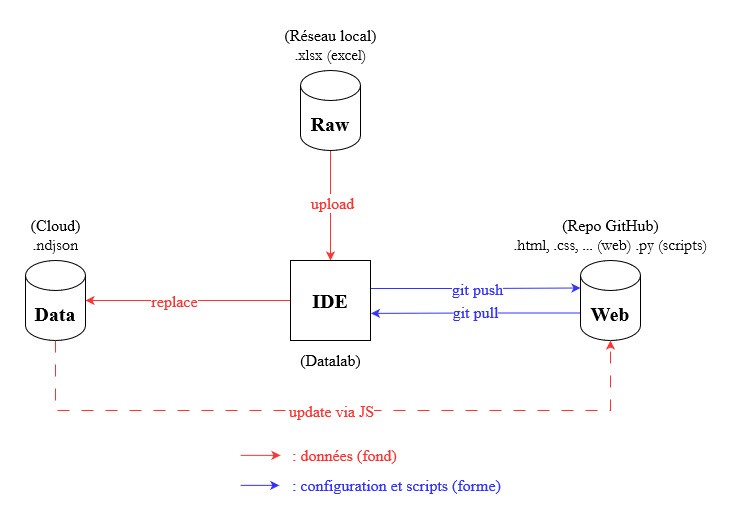

# Observatoire des AAP

> Ce projet de l'AFA fournit des indicateurs sur les AAP en France. [Voici une page de démo](https://139bercy.github.io/dashboard_widgets/index-afa-2021)

A destination du grand public, ce projet comporte :
- un aspect juridique (analyse et anonymisation des décisions de justice relatives aux AAP -> création des données brutes)
- un aspect informatique-datascience (production d'indicateurs via `python/pandas` -> création des données indicatices)
- un aspect informatique-web (mise en forme du projet)

Comme mentionné dans le [README](../README.md), il utilise des widgets web développé par Etalab pour la Covid.

## Répartition des ressources

Ce projet, en incluant les données nécessaires à son workflow, se répartit sur 3 emplacements :
- Le réseau local de l'AFA qui contient les données brutes.
- Le cloud OpenData du ministère qui permet de stocker les données indicatices : [data.economie.gouv.fr](data.economie.gouv.fr)
- Ce repo git qui contient les fichiers web (pour le web) et les scripts (pour les données).

L'IDE est fourni par [Nubonyxia](https://nubonyxia.incubateur.finances.rie.gouv.fr), une instance du projet [Onyxia](https://www.onyxia.sh/) de l'INSEE.
> Petit point Onyxia : L'instance de L'INSEE se nomme "[SSPCloud](https://datalab.sspcloud.fr)" et est hébergée sur leurs seveurs.
>
> Nubonyxia est hebergé sur les serveurs de la DGFiP nommés Nubo ("nuage" en Esperanto pour l'anecdote).
>
> De plus Nubonyxia, nécessitant un accès au RIE, est plus protégé.

## Avenir

Il est possible que l'aspect informatique-web soit confié à un prestataire :
- Le workflow de traitement des données ne consistera alors plus qu'à produire les données indicatrices, les stocker sur data.economie.gouv.fr puis à informer le prestataire des modifications à prendre en compte.

De plus l'accès à Nubonyxia pourrait être facturé car le RIE est trop utilisé et rame :
- Voir si on passe sur le SSPCloud, il y a aussi des questions de sécurité si les données sont sensibles.

## Lexique

- AFA : Agence Française Anticorruption
- AAP : Atteintes à la probité (la corruption n'en est qu'une parmis d'autres, légalement parlant)
- DGFiP : Direction Générales des Finances Publiques
- RIE : Réseau Interministériel d'Etat