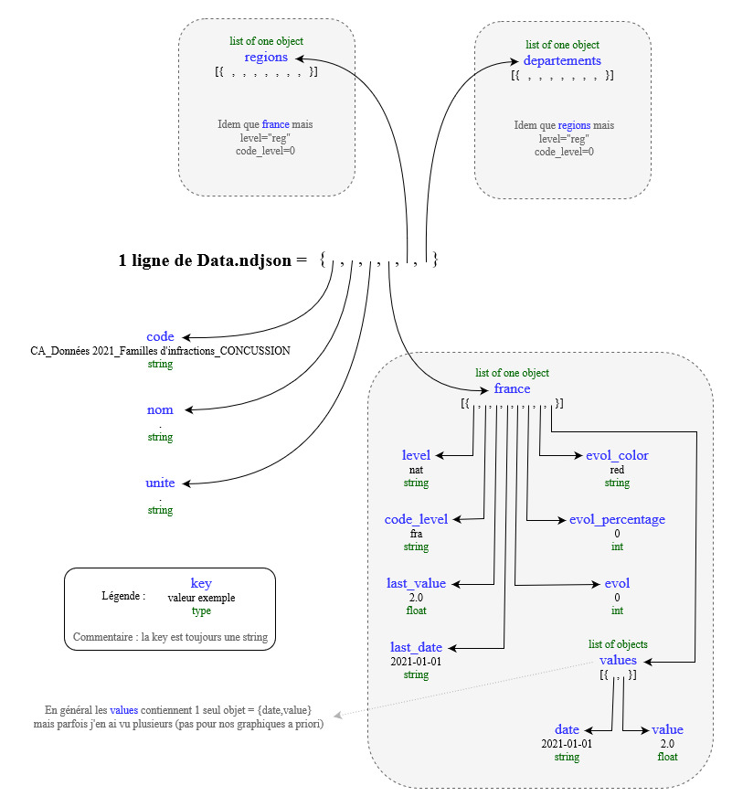

# Présentation

## Présentation générale

> Ce projet de l'AFA, à destination du public, fournit des indicateurs sur les AAP en France. [Page de démo](https://139bercy.github.io/dashboard_widgets/index-afa).

Ce projet comporte :
- un aspect juridique (analyse et anonymisation des décisions de justice relatives aux AAP -> création des données brutes)
- un aspect datascience (production d'indicateurs par des scripts `python` -> création des données indicatices)
- un aspect web (mise en forme du projet)

Comme mentionné dans le [README](../README.md), il utilise des widgets web développé par Etalab pour la Covid.

## Répartition des ressources

Ce projet se répartit sur 3 emplacements :
- Le réseau local de l'AFA -> contient les données brutes.
- Le [cloud OpenData du ministère](data.economie.gouv.fr) -> contient les indicateurs
- Ce repo git qui contient les fichiers web (notamment les configuations) et les scripts (pour les données).

L'IDE est fourni par [Nubonyxia](https://nubonyxia.incubateur.finances.rie.gouv.fr), une instance du projet [Onyxia](https://www.onyxia.sh/) de l'INSEE.
> L'instance de L'INSEE se nomme "[SSPCloud](https://datalab.sspcloud.fr)" et est hébergée sur leurs seveurs.
> Nubonyxia est hebergé sur le cloud de la DGFiP nommé Nubo ("nuage" en Esperanto pour l'anecdote). Nubo n'étant accessible que par le RIE, il est plus protégé.

## Autre

### Avenir

Il est possible que l'aspect informatique-web soit confié à un prestataire :
- Le workflow de traitement des données ne consistera alors plus qu'à produire les données indicatrices, les stocker sur data.economie.gouv.fr puis à informer le prestataire des modifications à prendre en compte.

De plus l'accès à Nubonyxia pourrait être facturé car le RIE est trop utilisé et rame :
- Voir si on passe sur le SSPCloud, il y a aussi des questions de sécurité si les données sont sensibles.

### Lexique

- AFA : Agence Française Anticorruption
- AAP : Atteintes à la probité (la corruption n'en est qu'une parmis d'autres, légalement parlant)
- DGFiP : Direction Générales des Finances Publiques
- RIE : Réseau Interministériel d'Etat

--------------------------------------------------------------------------------------------------------------------------------

# Aspects techniques

## Structures des données

### 1. data.ndjson

Le fichier data.ndjson est une suite d'objets où chaque objet est structuré comme selon ce graphique (je vous conseille d'ouvrir le fichie en parallèle) :

1 ligne = 1 objet correspond à une information sur nos graphiques. En général on veut juste un `id` ou `code` pour savoir où placer l'information et une `value`, parfois plus pour des graphiques où la valeur doit être datée par exemple, mais en général le couple `{id : value}` suffit. Il en résulte que ce format, héritage de l'ancienne fonction de graphes pour la covid du widget, est beaucoup trop lourd et redondant. On fait avec.

TODO : Analyser les valeurs utilisées par les donuts pour comprendre lesquels utiliser, comme il y a plusieurs endroits pouvant correspondra à `value`.

### 2. page.csv

Dans la même logique que data.ndjson, le fichier de configuration est également redondant et moche.

Les colonnes les plus pertinentes pour l'usage global sont :
- `Volet` : Nom du volet, 1er niveau de titre dans le nav.
- `No_panneau` et `Titre_panneau` : 2e niveau de titre dans le nav et titre du panneau dans le body.
- `No_onglet` et `Titre_onglet` : Titre de l'onglet dans le body.
- `Code_indicateur` : Id de l'information à aller chercher.
- `Titre_indicateur` et `Nom_indicateur` : Nom de l'information dans le body (légende, hover). Peut-être l'un est inutilisé.
- `Description_mesure` : Permet de modifier les notes de lecture de l'onglet associé à l'info.
- `source` : Permet de modifier la mention des sources de l'onglet associé.
- `accordéon` : Permet de modifier le texte de l'accordéon de l'onglet associé.

D'autres colonnes servent à mentionner le type de graphique (0 ou 1), son titre si 1 et éventuellement d'autres informations. Par exemple :
- `Pie` : 0 ou 1
- `Pie_titre` : Titre du camembert (qui est un donut pas un camembert...)
- `Pie_legende` : 0 ou 1. Sûrement pour activer ou désactiver l'afichage de la légende.

Les autres colonnes ont l'air inutiles.

### 1. Tableau excel

Les colonnes sont nommées par double-index (par exemple : "INFRACTION" -> "Code NatInf") TODO

